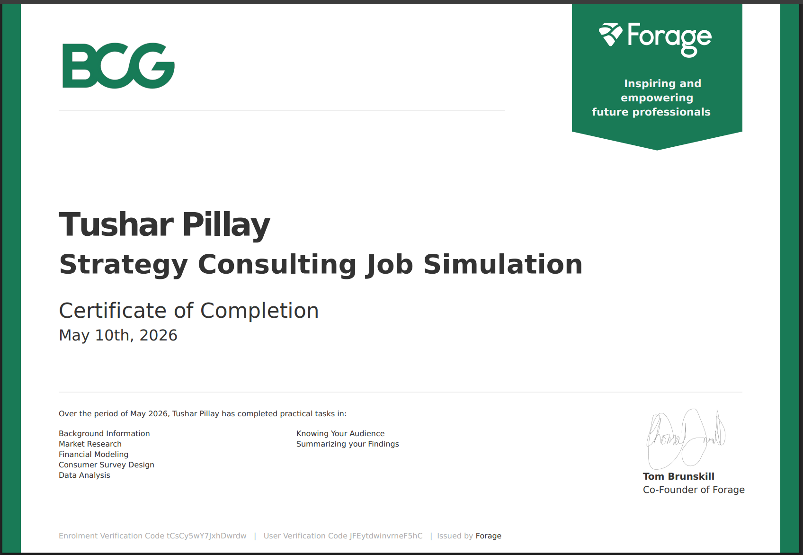

# BCG Strategy Consulting Virtual Experience Program

## 📜 Certificate

  

  <a href="certificate.pdf">View Certificate PDF</a>

---

## 📌 Overview
This project was completed as part of the Boston Consulting Group (BCG) Strategy Consulting Virtual Experience Program hosted on Forage. The simulation focused on helping a fictional global technology company, BeyondTech, evaluate the viability of implementing installment financing solutions to improve customer accessibility, increase market competitiveness, and drive long-term revenue growth.

The project simulated a real-world consulting engagement involving market research, financial benchmarking, customer analytics, stakeholder management, and strategic recommendation development.

---

# 🎯 Project Objectives
- Evaluate the feasibility of installment financing for BeyondTech
- Analyze customer demand and financing preferences
- Benchmark competitor financial performance
- Assess stakeholder perspectives and organizational risks
- Develop a strategic implementation roadmap
- Deliver consulting-style executive recommendations

---

# 📂 Project Tasks & Deliverables

---

## Task 1 – Market Research & Industry Analysis
📄 [View Task 1](./Task1.pdf)

### Key Activities
- Analyzed evolving consumer purchasing behavior
- Identified trends in affordability and financing adoption
- Evaluated industry financing strategies and market positioning

### Key Insight
Consumers increasingly prioritize affordability, flexible payment options, and access to premium technology.

---

## Task 2 – Installment Financing Viability Assessment
📄 [View Task 2](./Task2.pdf)

### Key Activities
- Conducted external research on financing models
- Evaluated financial and operational implications
- Developed preliminary strategic recommendations

### Key Insight
Installment financing improves accessibility and customer retention while introducing manageable operational risks.

---

## Task 3 – Financial Benchmarking Analysis
📄 [View Task 3](./Task3.pdf)

### Key Activities
- Compared competitor financial performance
- Assessed revenue growth, profitability, and cash flow impact
- Evaluated short-term and long-term financial outcomes

### Key Insight
Competitors with installment financing achieved stronger long-term revenue growth and improved customer retention.

---

## Task 4 – Customer Survey Design
📄 [View Task 4](./Task4.pdf)

### Key Activities
- Designed a 15-question customer financing survey
- Evaluated financing preferences and customer trade-offs
- Structured customer segmentation analysis

### Key Insight
Customers value low upfront costs, flexible repayment structures, and transparent financing terms.

---

## Task 5 – Customer Data & Insight Analysis
📄 [View Task 5](./Task5.pdf)

### Key Activities
- Analyzed customer survey responses
- Identified financing motivators and concerns
- Evaluated demographic and income-based adoption trends

### Key Insight
Younger and middle-income customer segments showed the strongest interest in installment financing models.

---

## Task 6 – Stakeholder Analysis
📄 [View Task 6](./Task6.pdf)

### Key Activities
- Evaluated executive stakeholder perspectives
- Identified organizational risks and implementation concerns
- Proposed stakeholder alignment strategies

### Key Insight
Successful implementation requires balancing financial risk management with customer experience and operational scalability.

---

## Task 7 – Executive Recommendation & Strategic Roadmap
📄 [View Task 7](./Task7.pdf)

### Key Activities
- Developed final consulting recommendation
- Proposed phased implementation roadmap
- Identified risks and mitigation strategies

### Key Insight
A phased installment financing strategy supported by financing partnerships can improve customer retention, accessibility, and long-term profitability.

---

# 📊 Key Business Insights
- Strong customer demand exists for flexible financing options
- Financing models improve accessibility to premium products
- Transparent financing structures are critical for customer trust
- Installment financing supports recurring revenue growth
- Strategic partnerships can reduce financial and operational risk exposure

---

# 🛠️ Skills & Tools Applied
- Strategic Analysis
- Market Research
- Financial Analysis
- Customer Segmentation
- Stakeholder Management
- Business Strategy
- Consulting Communication
- Survey Design
- Data Interpretation
- Executive Presentation

---

# 🚀 Final Recommendation
BeyondTech should implement a phased installment financing strategy focused on improving affordability, customer retention, and market expansion. A controlled rollout supported by financing partnerships and strong risk management practices can maximize long-term profitability while minimizing operational and financial risk.

---

# 🔗 Reference Links

## Boston Consulting Group (BCG)
https://www.bcg.com

## Forage Program
https://www.theforage.com/virtual-internships/prototype/BqF6gmrmLunCkdqKM/Strategy-Consulting-Virtual-Experience-Program

---

# 👨‍💻 Author
## Tushar Pillay
BSc in Data Science – IIT Madras

### Connect With Me
- LinkedIn: https://www.linkedin.com/
- GitHub: https://github.com/

---
⭐ If you found this project interesting, feel free to star the repository.
